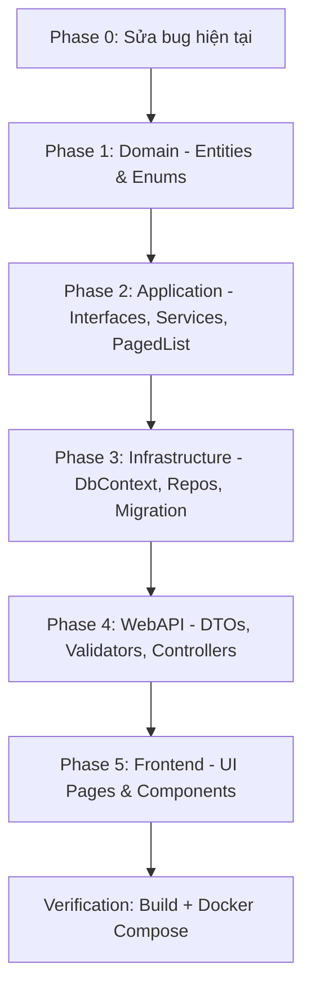

# Kế hoạch Triển khai Hệ thống Vietravel Tour Management

Triển khai đầy đủ 2 module **Quản lý Tour** (CRUD) và **Phiếu đề nghị đặt dịch vụ** theo spec trong `.claude/`, trên nền Clean Architecture (.NET 10) + Next.js 16.

## User Review Required

> [!IMPORTANT]
> **Database hiện có 1 migration đã seed 30 tours.** Kế hoạch sẽ tạo migration mới để thêm bảng `BookingRequests` + `RequestDetails` mà KHÔNG phá vỡ dữ liệu cũ.

> [!WARNING]
> **File `ApplicationExtension.cs` đang gọi `UseAuthentication()` 2 lần và thiếu `UseAuthorization()`.** Sẽ sửa thành `UseAuthentication()` + `UseAuthorization()`.

> [!IMPORTANT]
> **Frontend hiện dùng class Bootstrap (container, row, card...) nhưng KHÔNG import Bootstrap.** Sẽ viết lại hoàn toàn UI bằng TailwindCSS 4 (đã cấu hình sẵn) để đảm bảo hiển thị đúng và đẹp.

---

## Proposed Changes

### Phase 0: Sửa Bug Hiện Tại

#### [MODIFY] [ApplicationExtension.cs](file:///c:/Users/Thiet/Downloads/VietravelTest/Backend/WebAPI/Extensions/ApplicationExtension.cs)
- Sửa gọi `UseAuthentication()` 2 lần → `UseAuthentication()` + `UseAuthorization()`

#### [MODIFY] [Program.cs](file:///c:/Users/Thiet/Downloads/VietravelTest/Backend/WebAPI/Program.cs)
- Đảm bảo `app.UseAuthorization()` được gọi đúng vị trí trong pipeline

---

### Phase 1: Domain Layer — Entities mới

#### [MODIFY] [Tour.cs](file:///c:/Users/Thiet/Downloads/VietravelTest/Backend/Domain/Entities/Tour.cs)
- Thêm navigation property `ICollection<BookingRequest>` (quan hệ 1-N)

#### [NEW] [BookingRequest.cs](file:///c:/Users/Thiet/Downloads/VietravelTest/Backend/Domain/Entities/BookingRequest.cs)
```
Phiếu đề nghị đặt dịch vụ tour:
- Id (Guid, PK)
- TourName (string, required)
- DepartureDate (DateTimeOffset, required)
- PersonInCharge (string, required) — Người phụ trách
- TourType (enum: FIT/GIT/MICE, required)
- GuestCount (int, required, > 0)
- Status (enum: Received/PendingApproval/Approved) — Tự động gán
- TotalAmount (decimal) — Tính tự động từ tổng các dòng dịch vụ
- CreatedAt, UpdatedAt (DateTimeOffset)
- IsActive (bool), IsDeleted (bool) — Soft delete
- ICollection<RequestDetail> Details — Navigation property
```

#### [NEW] [RequestDetail.cs](file:///c:/Users/Thiet/Downloads/VietravelTest/Backend/Domain/Entities/RequestDetail.cs)
```
Chi tiết dịch vụ trong phiếu:
- Id (Guid, PK)
- BookingRequestId (Guid, FK)
- ServiceType (string, required) — Loại dịch vụ
- ServiceName (string, required) — Tên dịch vụ
- Supplier (string, required) — Nhà cung cấp
- Quantity (int, required, > 0)
- UnitPrice (decimal, required, > 0)
- LineTotal (decimal) — Tính = Quantity × UnitPrice
- Note (string?, optional) — Ghi chú
- IsDeleted (bool) — Soft delete
```

#### [NEW] [TourType.cs](file:///c:/Users/Thiet/Downloads/VietravelTest/Backend/Domain/Enums/TourType.cs)
```csharp
public enum TourType { FIT, GIT, MICE }
```

#### [NEW] [RequestStatus.cs](file:///c:/Users/Thiet/Downloads/VietravelTest/Backend/Domain/Enums/RequestStatus.cs)
```csharp
public enum RequestStatus { Received, PendingApproval, Approved }
```

---

### Phase 2: Application Layer — Interfaces & Services

#### [MODIFY] [ITourRepository.cs](file:///c:/Users/Thiet/Downloads/VietravelTest/Backend/Application/Interfaces/ITourRepository.cs)
Mở rộng interface cho full CRUD + pagination:
```csharp
Task<PagedList<Tour>> GetToursAsync(int pageNumber, int pageSize, CancellationToken ct);
Task<Tour?> GetByIdAsync(Guid id, CancellationToken ct);
Task<bool> ExistsByNameAsync(string name, Guid? excludeId, CancellationToken ct);
Task<Tour> CreateAsync(Tour tour, CancellationToken ct);
Task<Tour> UpdateAsync(Tour tour, CancellationToken ct);
Task DeleteAsync(Guid id, CancellationToken ct);
```

#### [MODIFY] [ITourService.cs](file:///c:/Users/Thiet/Downloads/VietravelTest/Backend/Application/Interfaces/ITourService.cs)
Tương tự mở rộng Service interface cho full CRUD.

#### [NEW] [IBookingRequestRepository.cs](file:///c:/Users/Thiet/Downloads/VietravelTest/Backend/Application/Interfaces/IBookingRequestRepository.cs)
```csharp
Task<PagedList<BookingRequest>> GetAllAsync(int pageNumber, int pageSize, CancellationToken ct);
Task<BookingRequest?> GetByIdAsync(Guid id, CancellationToken ct);
Task<BookingRequest> CreateAsync(BookingRequest request, CancellationToken ct);
Task<BookingRequest> UpdateAsync(BookingRequest request, CancellationToken ct);
Task<BookingRequest> ApproveAsync(Guid id, CancellationToken ct);
Task DeleteAsync(Guid id, CancellationToken ct);
```

#### [NEW] [IBookingRequestService.cs](file:///c:/Users/Thiet/Downloads/VietravelTest/Backend/Application/Interfaces/IBookingRequestService.cs)
Mirror interface tương tự repository nhưng ở tầng service.

#### [MODIFY] [TourService.cs](file:///c:/Users/Thiet/Downloads/VietravelTest/Backend/Application/Services/TourService.cs)
Triển khai full CRUD logic, gọi xuống repository, kiểm tra trùng tên.

#### [NEW] [BookingRequestService.cs](file:///c:/Users/Thiet/Downloads/VietravelTest/Backend/Application/Services/BookingRequestService.cs)
Triển khai logic:
- **Tạo phiếu:** Tính `LineTotal` cho từng dòng, tính `TotalAmount`, gán `Status` tự động
- **Cập nhật:** Kiểm tra trạng thái ≠ Approved trước khi cho sửa
- **Phê duyệt:** Chuyển Status → Approved
- **Xóa:** Kiểm tra trạng thái ≠ Approved, soft delete

#### [NEW] [PagedList.cs](file:///c:/Users/Thiet/Downloads/VietravelTest/Backend/Application/Common/PagedList.cs)
```csharp
public class PagedList<T>
{
    public List<T> Items { get; set; }
    public int PageNumber { get; set; }
    public int PageSize { get; set; }
    public int TotalCount { get; set; }
    public int TotalPages => (int)Math.Ceiling(TotalCount / (double)PageSize);
    public bool HasPrevious => PageNumber > 1;
    public bool HasNext => PageNumber < TotalPages;
}
```

---

### Phase 3: Infrastructure Layer — Data & Repositories

#### [MODIFY] [ApplicationDbContext.cs](file:///c:/Users/Thiet/Downloads/VietravelTest/Backend/Infrastructure/Data/ApplicationDbContext.cs)
- Thêm `DbSet<BookingRequest>` và `DbSet<RequestDetail>`
- Cấu hình quan hệ: `BookingRequest` → `RequestDetail` (1-N, Cascade delete)
- Thêm index trên `BookingRequests`: `Status`, `IsDeleted`
- Cấu hình Unique Name cho Tours

#### [MODIFY] [TourRepository.cs](file:///c:/Users/Thiet/Downloads/VietravelTest/Backend/Infrastructure/Repositories/TourRepository.cs)
Triển khai full CRUD:
- `GetToursAsync`: Filter `IsDeleted == false`, phân trang bằng `.Skip().Take()`
- `GetByIdAsync`: Filter `IsDeleted == false`
- `ExistsByNameAsync`: Kiểm tra tên tour unique (exclude current id khi update)
- `CreateAsync`, `UpdateAsync`: Set `CreatedAt`/`UpdatedAt`
- `DeleteAsync`: Soft delete → `IsDeleted = true`

#### [NEW] [BookingRequestRepository.cs](file:///c:/Users/Thiet/Downloads/VietravelTest/Backend/Infrastructure/Repositories/BookingRequestRepository.cs)
Triển khai repository pattern tương tự Tour, bao gồm:
- Eager loading `Include(x => x.Details)` khi lấy chi tiết
- Phân trang
- Soft delete cho cả phiếu lẫn các dòng dịch vụ

#### [NEW] Migration `AddBookingRequests`
- Tạo bảng `BookingRequests` + `RequestDetails` + FK + Index
- Không ảnh hưởng bảng Tours hiện có

---

### Phase 4: WebAPI Layer — Controllers, DTOs, Validation

#### DTOs — Request Models

#### [NEW] [CreateTourRequest.cs](file:///c:/Users/Thiet/Downloads/VietravelTest/Backend/WebAPI/DTOs/Requests/CreateTourRequest.cs)
```csharp
public record CreateTourRequest(string Name, string? Description, decimal Price, string City);
```

#### [NEW] [UpdateTourRequest.cs](file:///c:/Users/Thiet/Downloads/VietravelTest/Backend/WebAPI/DTOs/Requests/UpdateTourRequest.cs)
```csharp
public record UpdateTourRequest(string Name, string? Description, decimal Price, string City);
```

#### [NEW] [UpdateTourStatusRequest.cs](file:///c:/Users/Thiet/Downloads/VietravelTest/Backend/WebAPI/DTOs/Requests/UpdateTourStatusRequest.cs)
```csharp
public record UpdateTourStatusRequest(bool IsActive);
```

#### [NEW] [CreateBookingRequestDto.cs](file:///c:/Users/Thiet/Downloads/VietravelTest/Backend/WebAPI/DTOs/Requests/CreateBookingRequestDto.cs)
```csharp
public record CreateBookingRequestDto(
    string TourName,
    DateTimeOffset DepartureDate,
    string PersonInCharge,
    TourType TourType,
    int GuestCount,
    List<CreateRequestDetailDto> Details
);

public record CreateRequestDetailDto(
    string ServiceType,
    string ServiceName,
    string Supplier,
    int Quantity,
    decimal UnitPrice,
    string? Note
);
```

#### [NEW] [UpdateBookingRequestDto.cs](file:///c:/Users/Thiet/Downloads/VietravelTest/Backend/WebAPI/DTOs/Requests/UpdateBookingRequestDto.cs)
Tương tự CreateBookingRequestDto.

#### DTOs — Response Models

#### [NEW] [TourResponse.cs](file:///c:/Users/Thiet/Downloads/VietravelTest/Backend/WebAPI/DTOs/Responses/TourResponse.cs)
```csharp
public record TourResponse(Guid Id, string Name, string? Description, decimal Price, string City, bool IsActive, DateTimeOffset CreatedAt);
```

#### [NEW] [BookingRequestResponse.cs](file:///c:/Users/Thiet/Downloads/VietravelTest/Backend/WebAPI/DTOs/Responses/BookingRequestResponse.cs)
```csharp
public record BookingRequestResponse(
    Guid Id, string TourName, DateTimeOffset DepartureDate,
    string PersonInCharge, string TourType, int GuestCount,
    string Status, decimal TotalAmount, DateTimeOffset CreatedAt,
    List<RequestDetailResponse> Details
);

public record RequestDetailResponse(
    Guid Id, string ServiceType, string ServiceName,
    string Supplier, int Quantity, decimal UnitPrice,
    decimal LineTotal, string? Note
);
```

#### [NEW] [PagedResponse.cs](file:///c:/Users/Thiet/Downloads/VietravelTest/Backend/WebAPI/DTOs/Responses/PagedResponse.cs)
```csharp
public record PagedResponse<T>(
    List<T> Items, int PageNumber, int PageSize,
    int TotalCount, int TotalPages, bool HasPrevious, bool HasNext
);
```

#### Validation (FluentValidation)

#### [NEW] [CreateTourValidator.cs](file:///c:/Users/Thiet/Downloads/VietravelTest/Backend/WebAPI/Validators/CreateTourValidator.cs)
- Name: NotEmpty, kiểm tra trùng tên qua service
- Price: GreaterThan(0)
- City: NotEmpty

#### [NEW] [CreateBookingRequestValidator.cs](file:///c:/Users/Thiet/Downloads/VietravelTest/Backend/WebAPI/Validators/CreateBookingRequestValidator.cs)
- TourName, DepartureDate, PersonInCharge, TourType: NotEmpty
- GuestCount: GreaterThan(0)
- Details: NotEmpty, phải có ít nhất 1 dịch vụ
- Mỗi Detail: Quantity > 0, UnitPrice > 0

#### Controllers

#### [MODIFY] [ToursController.cs](file:///c:/Users/Thiet/Downloads/VietravelTest/Backend/WebAPI/Controllers/ToursController.cs)
Mở rộng thành full CRUD:
```
GET    /api/tours?pageNumber=1&pageSize=10  → Danh sách + phân trang
GET    /api/tours/{id}                       → Chi tiết
POST   /api/tours                            → Tạo mới (check trùng tên)
PUT    /api/tours/{id}                       → Cập nhật
PATCH  /api/tours/{id}/status                → Đổi trạng thái IsActive
DELETE /api/tours/{id}                       → Soft delete
```

#### [NEW] [RequestsController.cs](file:///c:/Users/Thiet/Downloads/VietravelTest/Backend/WebAPI/Controllers/RequestsController.cs)
```
GET    /api/requests?pageNumber=1&pageSize=10  → Danh sách + phân trang
GET    /api/requests/{id}                       → Chi tiết (include Details)
POST   /api/requests                            → Tạo phiếu + tự động tính toán
PUT    /api/requests/{id}                       → Cập nhật (chỉ khi chưa duyệt)
POST   /api/requests/{id}/approve               → Phê duyệt
DELETE /api/requests/{id}                       → Soft delete (chỉ khi chưa duyệt)
```

#### DI Registration

#### [MODIFY] [ServiceExtension.cs](file:///c:/Users/Thiet/Downloads/VietravelTest/Backend/WebAPI/Extensions/ServiceExtension.cs)
- Đăng ký `IBookingRequestRepository` / `IBookingRequestService`
- Đăng ký `FluentValidation` validators
- Thêm `services.AddFluentValidationAutoValidation()`

#### [MODIFY] [WebAPI.csproj](file:///c:/Users/Thiet/Downloads/VietravelTest/Backend/WebAPI/WebAPI.csproj)
- Thêm NuGet package: `FluentValidation.AspNetCore`

---

### Phase 5: Frontend — Giao diện Next.js + TailwindCSS 4

#### Cấu trúc thư mục Frontend mới:
```
Frontend/app/
├── layout.tsx              ← [MODIFY] Thêm navigation, metadata
├── globals.css             ← [MODIFY] Custom theme colors
├── page.tsx                ← [MODIFY] Trang chủ redirect hoặc landing
├── components/
│   ├── Navbar.tsx          ← [NEW] Thanh điều hướng chính
│   ├── Pagination.tsx      ← [NEW] Component phân trang tái sử dụng
│   ├── LoadingSpinner.tsx  ← [NEW] Loading state
│   └── ErrorAlert.tsx      ← [NEW] Error state
├── tours/
│   ├── page.tsx            ← [NEW] Danh sách tour (phân trang)
│   ├── [id]/
│   │   └── page.tsx        ← [NEW] Chi tiết tour
│   └── create/
│       └── page.tsx        ← [NEW] Form tạo tour
├── requests/
│   ├── page.tsx            ← [NEW] Danh sách phiếu đề nghị (phân trang)
│   ├── [id]/
│   │   └── page.tsx        ← [NEW] Chi tiết phiếu (xem/sửa)
│   └── create/
│       └── page.tsx        ← [NEW] Form tạo phiếu + dòng dịch vụ động
├── lib/
│   ├── api.ts              ← [NEW] API client wrapper (fetch + auth token)
│   └── types.ts            ← [NEW] TypeScript interfaces
```

#### Chi tiết UI từng trang:

**1. Navbar** — Thanh điều hướng cố định trên cùng
- Logo Vietravel + Link: Trang chủ, Quản lý Tour, Phiếu đề nghị

**2. Tours List Page** (`/tours`)
- Bảng danh sách: Tên, Thành phố, Giá, Trạng thái (badge Active/Inactive)
- Phân trang
- Nút "Tạo Tour Mới"
- Nút Edit/Delete mỗi dòng

**3. Tour Detail Page** (`/tours/[id]`)
- Hiển thị đầy đủ thông tin tour
- Nút Edit / Toggle Status / Delete

**4. Tour Create Page** (`/tours/create`)
- Form: Tên tour, Mô tả, Giá, Thành phố
- Validation client-side

**5. Requests List Page** (`/requests`)
- Bảng: Tên tour, Loại tour, Số khách, Tổng tiền, Trạng thái (badge màu)
- Phân trang
- Nút "Tạo phiếu mới"
- **Logic khóa button:** Nếu Status = "Approved" → disable Edit/Delete

**6. Request Create Page** (`/requests/create`)
- Form thông tin chung: Tên tour, Ngày khởi hành, Người phụ trách, Loại tour (dropdown FIT/GIT/MICE), Số khách
- **Cảnh báo MICE:** Nếu chọn MICE và số khách < 10 → hiển thị warning banner
- **Danh sách dịch vụ động:** Nút "Thêm dịch vụ" thêm dòng mới, nút "Xóa" mỗi dòng
- Mỗi dòng: Loại dịch vụ, Tên dịch vụ, NCC, Số lượng, Đơn giá, Ghi chú
- Auto-tính: Line Total, Tổng chi phí phiếu (hiển thị realtime)

**7. Request Detail Page** (`/requests/[id]`)
- Hiển thị toàn bộ thông tin phiếu + bảng dịch vụ
- Badge trạng thái với màu:
  - "Đã tiếp nhận" → xanh dương
  - "Chờ duyệt quản lý" → vàng cam
  - "Đã phê duyệt" → xanh lá
- Nút Duyệt (nếu chưa duyệt), Edit, Delete (vô hiệu hóa nếu đã duyệt)

---

## Thứ tự triển khai



| Phase | Ước lượng files | Mô tả |
|-------|----------------|-------|
| Phase 0 | 2 files sửa | Fix bug UseAuthentication/UseAuthorization |
| Phase 1 | 4 files mới + 1 sửa | Entities + Enums |
| Phase 2 | 5 files mới + 2 sửa | Interfaces, Services, PagedList |
| Phase 3 | 1 file mới + 2 sửa + 1 migration | DbContext, Repos |
| Phase 4 | ~12 files mới + 3 sửa | DTOs, Validators, Controllers, DI |
| Phase 5 | ~14 files mới + 3 sửa | Frontend UI hoàn chỉnh |
| **Tổng** | **~38 files mới, ~13 files sửa** | |

---

## Open Questions

> [!IMPORTANT]
> **1. FluentValidation — check trùng tên Tour:** Hiện tại spec yêu cầu kiểm tra Unique Tour Name bằng FluentValidation. Cách tiếp cận: inject `ITourRepository` vào Validator để check async. Bạn có đồng ý hướng này hay muốn check ở tầng Service rồi throw exception?

> [!IMPORTANT]
> **2. Connection String cho môi trường Development:** Hiện không có config cho PostgreSQL local (chỉ có trong `docker-compose.yml`). Bạn muốn tôi thêm connection string trong `appsettings.Development.json` để chạy local không? Hay chỉ chạy qua Docker?

> [!IMPORTANT]  
> **3. Frontend Authentication flow:** Hiện backend có endpoint `GET /api/auth/login` tạo token đơn giản. Frontend cần auto-login khi khởi động hay bạn muốn trang login riêng?

> [!IMPORTANT]
> **4. Xóa file `tours.module.css`?** File CSS module hiện có nhưng không được sử dụng. Vì chuyển sang TailwindCSS 4, bạn có muốn tôi xóa file này không?

---

## Verification Plan

### Automated Tests
1. **Backend build:** `dotnet build Backend/TourManagement.slnx` — đảm bảo compile thành công
2. **EF Migration check:** `dotnet ef migrations list` — đảm bảo migration hợp lệ
3. **Frontend build:** `cd Frontend && npm run build` — đảm bảo TypeScript compile + Next.js build thành công

### Docker Integration
4. **Docker Compose:** `docker compose up --build` — đảm bảo cả 3 containers (Postgres + API + Frontend) khởi động thành công và giao tiếp được với nhau

### Manual Verification
5. Kiểm tra API endpoints qua Swagger/curl:
   - CRUD Tour đầy đủ + pagination
   - CRUD Phiếu đề nghị + auto-calculate + status logic
   - Validation errors trả đúng format
6. Kiểm tra Frontend:
   - Navigation giữa các trang
   - Hiển thị loading/error states
   - Form tạo phiếu với dịch vụ động + cảnh báo MICE
   - Phân trang hoạt động
   - Button Edit/Delete bị khóa khi phiếu đã duyệt
